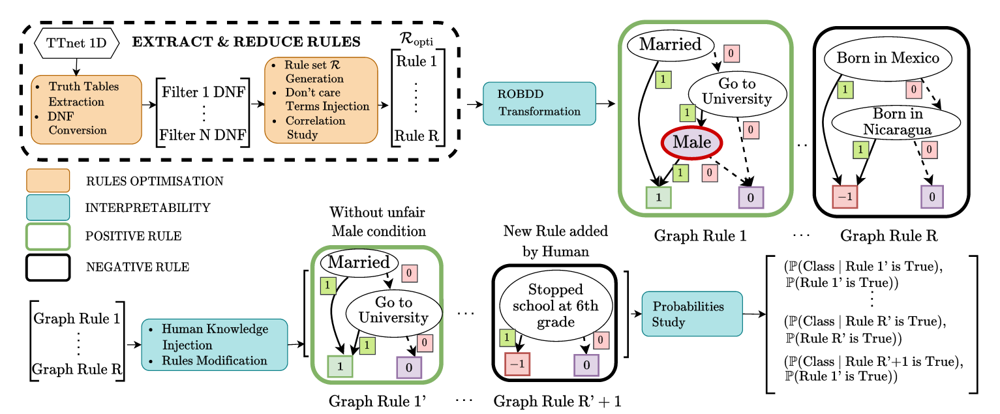
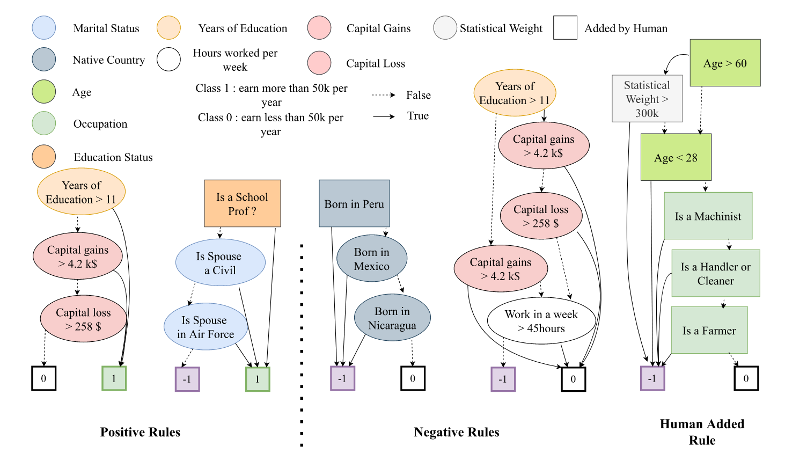
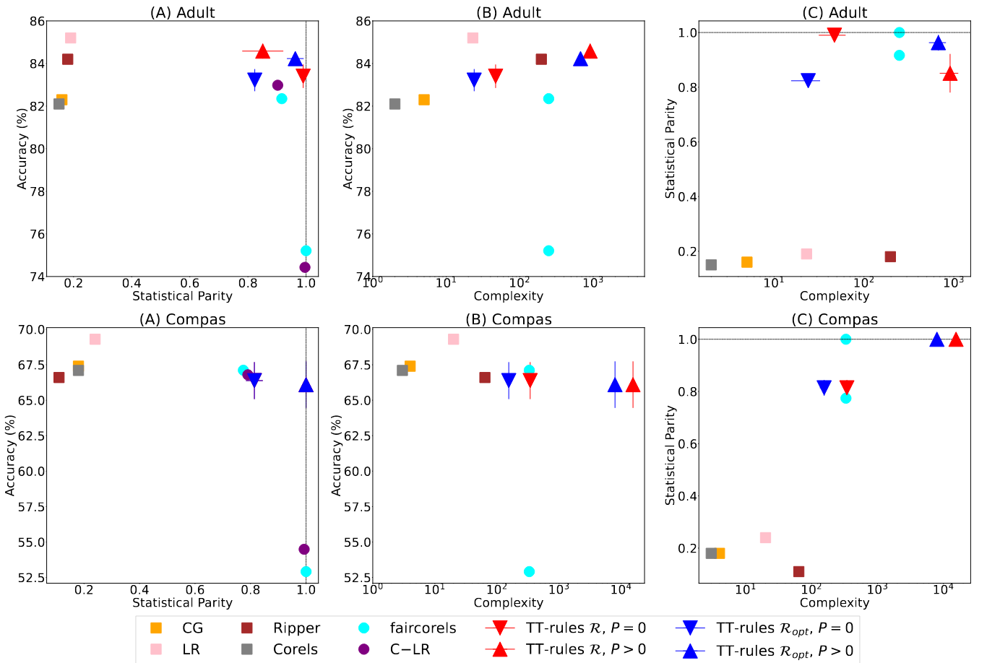

# TT-rules

This repository is the implementation Reproducibility part for submitted paper TT-Rules: Extracting & Optimizing Exact Rules of a CNN-Based Model - Application to Fairness

Most Machine Learning (ML) models are ``black box'' models, but in critical domains such as healthcare, energy, finance, military, or justice, they need to be globally and exactly interpretable. Creating ML models convertible by design into rule-based models is an attractive solution: they produce all the rules (global nature of interpretability) that allow us to obtain exactly the output result (exact nature of interpretability). Today, these rule-based models are mainly decision trees, whose natural interpretability is outweighed by their poor performances and scalability. In this paper, we offer a new three-step framework, TT-rules, that extracts and optimizes exact rules from a recent family of Convolution Neural Networks (CNNs) called Truth Table nets (TTnets). First, we show how to extract rules $\mathcal{R}$ in Disjunction Normal Form (DNF) from TTnets, which we adapt and enhance for tabular datasets. Secondly, we explain how the TT-rules framework permits the optimization of two key interpretability factors, namely the number of rules and their size, transforming the original set $\mathcal{R}$ into an optimized $\mathcal{R}\_{opt}$. Our rule-based model is thus composed of $\mathcal{R}\_{opt}$ with a final binary linear regression and allows multi-label classification. In a third step, we improve the rules' visualization by converting them into Reduced Ordered Binary Decision Diagrams (ROBDD) and enriching them by computing interesting associated probabilities. To evaluate TT-rules' performances, we applied it to two tabular healthcare datasets and two fairness datasets. Our framework reaches competitive results compared to state-of-the-art rule-based models in terms of accuracy, complexity, and statistical parity, also giving exact and global interpretability. In addition, we show that practitioners can use their domain knowledge to diagnose individual fairness of a given TT-rules model by analyzing and further modifying the rules $\mathcal{R}_{opt}$. As an example of the compactness of our framework's output, we draw all the rules in $\mathcal{R}\_{opt}$ for one model on the Adult dataset (only 15 conditions for an 84.6\% accuracy).

Our main contributions:

1. First, in order to apply TTnet family~\cite{benamira2022truth}, which originally uses two-Dimensional-Convolutional Neural Network (2D-CNN), on a tabular dataset, we extend it to 1D-CNN. To overcome the natural limitation of TTnet being decoupled, we introduce a new input redundancy strategy to increase the accuracy performance.

2. Then, leveraging the technique proposed in the original TTnet paper, we transform each of the filters into a truth table, followed by a conversion into a DNF equation. Another contribution of our work is the addition of a final process to convert each DNF equation into a set of rules $\mathcal{R}$. Next, to enhance this transformation, we propose two optimizations to make the post-processing interpretability readily amenable by experts. 

  a) Indeed, first we decrease the size of each rule in $\mathcal{R}$ by incorporating the \textit{don't care terms} in truth tables thanks to human logic, an operation not presented in the original paper~\cite{benamira2022truth}. 
  
  b) Secondly, we decrease the number of rules in $\mathcal{R}$ by introducing the inter-rules correlations score and by analyzing them. These two optimizations, only possible for TTnet, transform the set $\mathcal{R}$ into an optimized one $\mathcal{R}\_{opt}$. We clearly quantify the trade-off between performance, the number of rules, and the rules' size. At the end of the second step, the rule-based model is created. For class prediction, one only needs to sum all the rules in $\mathcal{R}\_{opt}$ according to a binary linear regression.
  
3.  In a third step, we further enhance the global and exact interpretability 

   a) by first converting all rules equations to ROBDD for better visualization. 
   
   b) Then, we propose to compute valuable probabilities associated with each rule of the set of rules $\mathcal{R}\_{opt}$. For instance, the probability to have a class $\texttt{C}$ knowing that the rule $\texttt{r} \in \mathcal{R}\_{opt}$ is activated $\mathbb{P}(\texttt{C | r is True})$ and others relevant properties. 

4. To illustrate the interpretable value of our framework, we apply it to two critical fields: healthcare (Cancer and Diabetes datasets) and fairness (Adult and Compas datasets). We demonstrate that our framework reaches competitive results when compared to state-of-the-art rule-based models in terms of accuracy, complexity, and group-fairness measured with statistical parity while giving exact and global explanations. In addition, applying our approach to the field of individual-fairness, we establish that human knowledge-based post-processing allows us to improve the model through a clear understanding of the learned rules and a compact decision-making mechanism. We show that given a sensitive feature and a rule set $\mathcal{R}\_{opt}$, ``ghost proxies rules'' can be manually identified and targeted. They are rules that are difficult to discover in models (hence \textit{ghost}) and that contain features that are proxies of the sensitive attribute (hence \textit{proxies}). We precisely illustrate the above statement by developing a concrete TT-rules model use-case study on the Adult dataset, given in Figure above. In addition, we managed to generate 5 extremely compact rules of small sizes (15 conditions in total) while retaining a good accuracy of 84.6\% on Adult dataset (for comparison other rule-set-models~\cite{dash2018boolean, cohen1999simple, angelino2017learning} provide 82.3\% accuracy for 4 conditions or 84.9\% for 230 conditions on the same dataset). The global TT-rules framework is depicted in Figure above. 

## Building

We do not provide the code for training or generating the rules - only the rules themselves for all datasets and all models. The rest will come after the paper is accepted. 

## Usage

The rules can be downloaded here for [Adult](https://drive.google.com/file/d/1-TP_mFDv3aGi77LWUIK83-CE9Zx2v8ZD/view?usp=sharing), [Compas](https://drive.google.com/file/d/1TzU1rKJL6gFy55zxELvWtF5_VlkBht6g/view?usp=sharing), [Cancer](https://drive.google.com/file/d/1d3r7pvobzcX_Q9piPIG3bXYklmINjYs3/view?usp=sharing), [Diabetes](https://drive.google.com/file/d/1GU3-7ce9WLsyV0EnTdLGdiwiFkMt5bSr/view?usp=sharing).

## Use case

XXX provides the use case.

## Results

Details results can be found into *.csv
